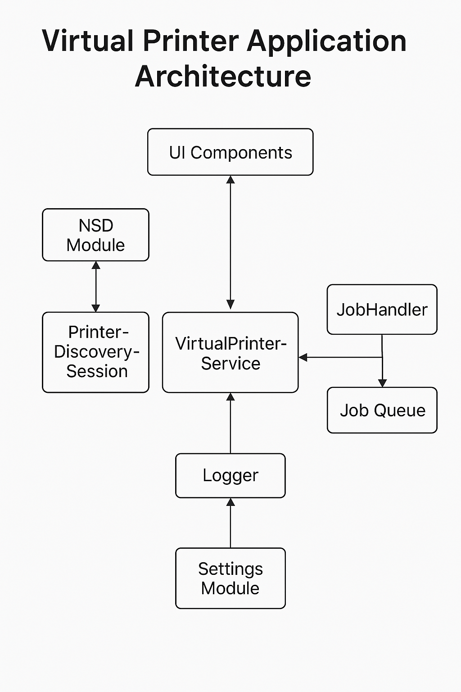

---
# VirtualPrinterApplication

### **Description**  
The **Virtual Printer App** is an Android application that emulates a network printer. It allows developers and testers to simulate printing operations without needing physical printer hardware. 

This app aims to facilitate testing and debugging print-related functionalities in Android applications, especially when real printers are inaccessible or impractical to use.

#### **Key Features:**  
- Acts as a virtual IPP (Internet Printing Protocol) printer on Android devices.  
- Supports configuration of printer attributes and capabilities.  
- Responds to print jobs and emulates success or failure scenarios.  
- Compatible with Android's built-in print services, allowing for easy integration and testing.  
- Supports customization of the virtual printer via configuration files.  
- End-to-end testing support for different print settings and print job responses.  
- Works on various Android form factors, including phones, foldables, and tablets.  

#### **Use Cases:**  
- Testing Android applications that interact with printers.  
- Validating print services on Android without needing physical printers.  
- Automating print testing in CI environments.  

#### **Technology Stack:**  
- **Kotlin & Jetpack Compose** for the Android front-end.  
- **IPPEvePrinter** as the backend IPP implementation.  
- **NSD (Network Service Discovery)** for broadcasting the printer over the network.  
- **jIPP** (optional) for IPP handling in pure Kotlin.  
- **NDK** (if using native code for IPP).  

 
### Drafted Architecture and Design Elements:

1. **High-Level Application Architecture:**
   - **Service-Oriented Structure:** Separation between UI components, network discovery, and the virtual print service logic.
   - **Modular Layers:**
     - UI Layer (Jetpack Compose + Navigation)
     - Print Service Module (handles IPP requests)
     - NSD Module (Network Service Discovery)
     - Configuration/Settings Module (to define printer capabilities)

2. **Basic UML Planning:**
   - Identified the need for:
     - A `VirtualPrinterService` class implementing `PrintService`
     - A `JobHandler` or `PrintJobManager` to process jobs
     - A `PrinterDiscoverySession` to manage discovered printers

3. **Data Flow Design (early stage):**
   - Data flow starts with Android's system invoking the `PrintService` after discovery.
   - Print jobs go through an internal processing pipeline (JobQueue → JobHandler → Logger/UI update).

4. **UI Layout Mock (via Compose):**
   - A basic UI prototype that logs print job events, printer status, and allows printer config.

---



 
## Requested Additions

- ✅ Acts as a virtual IPP (Internet Printing Protocol) printer on Android devices.  
- ✅ Working Android Application 
- ✅ Network Service Discovery
- ⬜ **HIGH PRIORITY** - Supports configuration of printer attributes and capabilities.  
- ⬜ **HIGH PRIORITY** - End-to-end testing support for different print settings and print job responses.  
- ⬜ Printer Manager API
- ⬜ Works on various Android form factors, including phones, foldables, and tablets.  
 


 ## 🛠️ [Read the Documentation]( https://drive.google.com/file/d/1YBwNsdDVSojUsYf2G_VNnU9_9w3t4Ad2/view?usp=sharing)


<details>
  <summary><h2>Getting Started</h2></summary>


1. Clone the repository:  
   ```
   git clone https://github.com/username/VirtualPrinter.git
   ```
2. Open the project in Android Studio.  
3. Build and run on an Android device.  
4. Access the virtual printer from Android’s built-in print services.  
</details>

--- 
